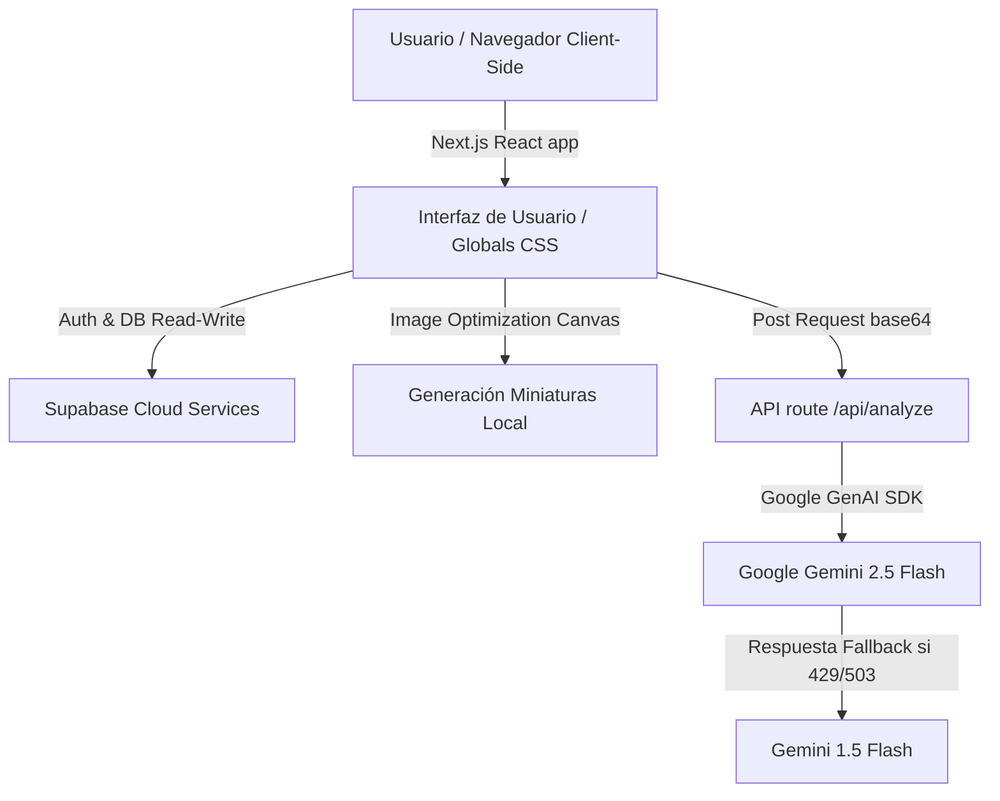

# 🌿 EcoScan AI: Tu Asistente Botánico Inteligente
**Proyecto Hackathon "Build With AI 2026" — Sede Santa Cruz, Bolivia**  
*Mención Temática:* **AGRO / MEDIO AMBIENTE**  

EcoScan AI es una plataforma web inteligente diseñada para combatir la alta tasa de mortalidad de plantas urbanas y promover el cuidado consciente de la flora doméstica y huertos urbanos en Santa Cruz de la Sierra. La solución automatiza los cronogramas de riego y fertilización mediante el diagnóstico visual asistido por Inteligencia Artificial y un chatbot experto contextualizado.

---

## 👥 Colaboradores / Integrantes de Equipo
* **[Ingresa Nombre Integrante 1]** - Rol (Ej. Backend / AI Specialist)
* **[Ingresa Nombre Integrante 2]** - Rol (Ej. Frontend / UI Designer)
* **[Ingresa Nombre Integrante 3]** - Rol (Ej. Business Analyst / Pitch Specialist)
*(Agrega o edita los colaboradores antes de realizar la entrega oficial).*

---

## 📂 Documentación del Proyecto (Negocio y Presentación)
Para cumplir con los entregables obligatorios de la hackathon, el proyecto incluye los siguientes documentos estratégicos:
1. **[BUSINESS.md](BUSINESS.md):** Contiene el análisis macro del entorno (**PESTEL**), el análisis de la solución (**FODA**), el modelo de negocio (**Lean Canvas**), el **Estudio de Viabilidad Financiera** (costos de API Gemini vs. ingresos Premium) y el **Impacto Regional** en Santa Cruz de la Sierra.
2. **[PITCH.md](PITCH.md):** Detalla la **estructura de diapositivas** para la presentación del Demo Day y el **guion técnico palabra por palabra** estructurado para el video de 2 minutos exigido por la organización.
3. **[schema.sql](schema.sql):** Script SQL con la definición de la base de datos relacional para migrar el sistema a Supabase, incluyendo **Row Level Security (RLS)**.

---

## 🚀 Características Clave del MVP
* **Diagnóstico Multimodal con IA:** Carga una foto de tu planta y obtén su nombre común/científico, porcentaje de confianza, análisis de salud y recomendaciones automáticas de riego y fertilizante con `gemini-2.5-flash`.
* **Asistente IA Contextual:** Un chatbot conversacional que conoce la especie, el historial de actividades y el estado de salud exacto de la planta seleccionada para responder dudas específicas de cuidado.
* **Alertas y Cuenta Regresiva de Riego:** Cuenta regresiva dinámica en tiempo real (días, horas, minutos) que indica cuándo la planta necesita agua y cambia de color según la urgencia de atención.
* **Gamificación Botánica:** Sistema lúdico de logros y rachas de cuidado para incentivar que el usuario mantenga viva su planta y cree hábitos consistentes.
* **Control de Planes Freemium / Premium:** Simulación de límites de negocio (límite de 1 planta y 20 mensajes de chat diarios para usuarios gratuitos) con pasarela visual de upgrade.

---

## 🛠️ Arquitectura y Tecnologías
La aplicación está construida sobre una arquitectura moderna, serverless y de alta disponibilidad:



* **Frontend:** Next.js (App Router) con Vanilla CSS y Tailwind para una estética premium.
* **Backend:** Next.js API Routes.
* **Base de Datos & Auth:** Supabase (PostgreSQL) con políticas de seguridad de datos **RLS**.
* **Inteligencia Artificial:** SDK oficial de `@google/genai` utilizando `gemini-2.5-flash` y `gemini-1.5-flash` de respaldo.

---

## 📥 Instrucciones de Configuración y Ejecución Local

### 1. Requisitos Previos
* Tener instalado [Node.js](https://nodejs.org) (versión 18 o superior).
* Cuenta en [Supabase](https://supabase.com) y en [Google AI Studio](https://aistudio.google.com) para obtener las API keys.

### 2. Clonar y Configurar Dependencias
```bash
# Instalar dependencias del proyecto
npm install
```

### 3. Configurar Base de Datos en Supabase
1. Ve a tu panel de **Supabase -> Tu Proyecto -> SQL Editor**.
2. Copia todo el contenido del archivo `schema.sql` y ejecútalo para crear las tablas `plants` y `profiles` con sus políticas de seguridad (RLS).

### 4. Variables de Entorno
Crea un archivo `.env.local` en la raíz del proyecto con la siguiente estructura y reemplaza los valores:
```env
# Gemini API
GEMINI_API_KEY=tu_api_key_de_gemini

# Supabase Keys (Visibles en Project Settings -> API)
NEXT_PUBLIC_SUPABASE_URL=tu_supabase_project_url
NEXT_PUBLIC_SUPABASE_ANON_KEY=tu_supabase_anon_key
```

### 5. Iniciar Servidor de Desarrollo
```bash
npm run dev
```
Abre tu navegador en [http://localhost:3000](http://localhost:3000) para ver la aplicación funcionando en tiempo real.
